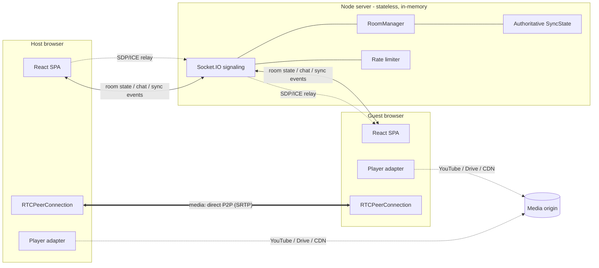

# SyncRoom, Architecture

## Overview



Three packages, one repo (npm workspaces):

| Package            | Role                                                                                                                                                                                                   |
| ------------------ | ------------------------------------------------------------------------------------------------------------------------------------------------------------------------------------------------------ |
| `@syncroom/shared` | Protocol types, room-code/name validation, media-URL parsing, sync math, clock-offset estimator. Zero runtime deps; imported by both sides so client and server can never disagree about the protocol. |
| `@syncroom/server` | Node 20 + Socket.IO. Rooms, membership, host powers, chat history (bounded), queue and the authoritative playback state, all in memory. Serves the built SPA in production (one process, one port).   |
| `@syncroom/client` | Vite + React 18 + TypeScript strict + Tailwind + zustand. Feature-sliced folders.                                                                                                                      |

## Key decisions & why

### 1. Media: P2P mesh, not SFU

The brief asks for maximum quality (1080p/1440p/4K, 60fps, minimal compression/latency) at minimal server cost for **two (optionally a few) users**. That is precisely the case where P2P wins:

- **Quality**, the encoder's output travels untouched to the peer. No SFU re-termination, no simulcast layer selection, no transcoding. 4K60 works if both links allow it (we set generous `maxBitrate` ceilings per preset, up to 25 Mbps).
- **Latency**, one network hop; typically 30–80 ms glass-to-glass on the same continent.
- **Cost**, media never touches our server. The signaling server relays only JSON; it runs comfortably on the smallest VPS/free tier.

**The trade-off is upload fan-out**: with N participants each client uploads N−1 copies. That's fine at 2 (the primary use case) and acceptable to ~4–5 at 1080p; we cap rooms at 8. **When an SFU becomes better:** >4–5 participants, mobile uplinks, or recording needs, then each client uploads once and the SFU fans out. The clean migration path is [LiveKit](https://livekit.io) (open source, self-hostable): swap `usePeerConnections` for LiveKit's React SDK and delete our signaling relay; room/chat/sync layers are transport-agnostic and stay unchanged. See `docs/ROADMAP.md`.

- NAT traversal: STUN (Google's public servers) works for most pairs; strict NATs need TURN, configurable via `VITE_TURN_URL/USERNAME/CREDENTIAL` (coturn or a managed service). Without TURN, ~10–15% of pairs may fail to connect.

### 2. State: fully in-memory, no database

Rooms exist only while occupied (60s empty-room grace, 15s reconnect grace per participant). Chat history is a bounded ring buffer per room, attachments live in that buffer only. Nothing is persisted, restart the server and rooms simply re-form on the next join (clients auto-rejoin with their stable `participantKey`). This satisfies the "stateless, minimal cost" requirement with zero moving parts. Adding Redis only becomes necessary for multi-instance scale-out (sticky sessions + socket.io-redis adapter), documented in `docs/DEPLOYMENT.md`.

### 3. Auth: none, by design

Rooms are capability URLs: knowing the code = being invited. Codes are validated server-side, joins are IP-rate-limited, rooms can be locked, and hosts can kick. For private deployments, OAuth can be added in front (roadmap) without touching the room layer.

### 4. Playback sync: host-authoritative, event-driven state machine

**Single source of truth.** The server stores one tiny record per room:

```
SyncState = { media, playing, time, rate, updatedAt, seq, originId, eventId }
```

`time` is the position **at server timestamp `updatedAt`**. Positions are never streamed (no per-frame `currentTime` traffic), every client _derives_ the expected position:

```
expected(t) = playing ? time + (serverNow - updatedAt)/1000 × rate : time
```

**Event model.** The only sync events on the wire are explicit user actions, `sync:set-media`, `sync:play`, `sync:pause`, `sync:seek` (debounced: one event after scrubbing ends), `sync:rate`, `sync:clear`, each carrying a client-generated `eventId`. The server validates, applies to the room record, stamps it (`seq++`, `updatedAt`, `originId`, `eventId`) and broadcasts the full `SyncState`. Media end and host changes flow through `queue:play` (host-only auto-advance) and `room:state`.

**Loop prevention is structural, not a timer.** The client-side `SyncController` (one per media item) maintains two mechanisms:

1. **Monotonic `seq` gate**, a received state with `seq ≤ lastApplied` is dropped (stale/out-of-order/duplicate). Counted as "dropped" in debug mode.
2. **Intent ledger**, every programmatic adapter command (`play()`, `pause()`, `seek(t)`, `setRate(r)`) first registers an intent. When the player later fires the corresponding event, the controller matches and consumes the intent: the echo is never re-broadcast. Unmatched events from a controller are genuine user actions → exactly one emission (identical consecutive emissions within 500 ms are collapsed). Unmatched events from a non-controller snap the player back to authority.

**Diff-based application.** Applying a state never blindly drives the player: the controller reads `getState()`/`getRate()`/`getTime()` first and only issues commands whose dimension actually changed, never `playVideo()` on an already-playing player, never a seek within 0.5 s of the target, never a redundant `setPlaybackRate()`. This keeps the YouTube IFrame API well under its rate limits.

- **Clock sync**, each client estimates `serverNow` via NTP-style ping sampling (keep the lowest-RTT sample of a sliding window; `ClockSync` in shared). Accuracy is typically <30 ms.
- **Drift correction**, every 2 s each non-controller compares its player position with `expected(now)`:
  - ≤ 150 ms → ignore (player jitter),
  - 150–500 ms → _invisible_ correction: playback-rate nudge of 2–4% until re-aligned, then back to the authoritative rate,
  - ≥ 500 ms → one hard seek.
    Correction is skipped entirely while the player reports `buffering`.
- **Host heartbeat**, the host never self-corrects (it _is_ the truth); instead, if its actual player position diverges >250 ms from the derived state (e.g. after buffering), it re-anchors server authority, at most once per 10 s, and only when needed. Zero traffic when nothing drifts.
- **Late join**, the room snapshot includes the stamped `SyncState`; a joiner loads the media, adopts `seq`, computes `expected(now)` and starts in the correct play/pause state at the correct position and rate.
- **Reconnect**, the silent rejoin returns the same snapshot; the seq gate makes reapplication idempotent, so playback never restarts from zero.

**Provider abstraction.** Player differences are hidden behind one `PlayerAdapter` interface (`load / play / pause / seek / setPlaybackRate / getCurrentTime / getDuration / getPlaybackRate / getState / canSync / canSeek / canSetRate / onEvent / destroy`) with three implementations: YouTube IFrame API, HTML5 `<video>` (direct files, hls.js, dash.js, Drive direct URLs, engines lazy-loaded), and the Drive preview iframe (`canSync() === false`, rendered, never driven). The capability probes let the controller degrade per dimension: live HLS streams (`canSeek() === false`) never receive seeks; unsyncable providers are left alone with one clear notice. The controller contains zero provider-specific logic; a new provider is a new adapter file, and switching YouTube → Drive → MP4 replaces the playback session in place (full dispose, no page refresh). Google Drive constraints are documented in `docs/FEATURES.md`.

**Debug mode.** `?debug` (or `localStorage['syncroom:debug']='1'`) renders a HUD over the player: provider, phase, playback state, position, live drift, last sync event, socket RTT, sent/received/dropped counters. Off by default in production.

### 5. Signaling protocol

Fully typed end-to-end: `ClientToServerEvents` / `ServerToClientEvents` interfaces in shared are consumed by both the Socket.IO server and client, so a protocol change that breaks either side fails `tsc`. Snapshot-plus-deltas model: membership/host changes broadcast a full (small) `room:state`; chat/sync/signal use targeted events.

### 6. Security posture

- All inputs validated server-side (codes, names, times, rates, URLs, attachment size/MIME).
- Token-bucket rate limiting per class (join by IP; chat/sync/signal by socket).
- React renders all user content as text (no injection); attachments transfer as data URLs with server-enforced caps.
- Host-only actions verified server-side against `room.hostId`, never trusted from the client.
- Duplicate-join rejection via per-tab `participantKey`; refresh reclaims the same identity within a grace window.

### 7. Scalability & resilience

The signaling server is deliberately cheap to run, and hardened so a load spike
degrades gracefully instead of crashing. All knobs are env-configurable (see
`.env.example`); defaults suit one ~512 MB / shared-CPU instance.

- **Media never transits the server.** Audio/video is full-mesh P2P (SRTP); the
  socket carries only JSON signaling + small room events. The single exception
  is the Google-Drive proxy (a same-origin, seekable source for the synced
  HTML5 player), which _streams_ (never buffers) and is capped at
  `MAX_DRIVE_STREAMS` concurrent streams so it can't saturate the box.
- **Overload protection.** New WebSocket handshakes past `MAX_CONNECTIONS` are
  rejected at the Engine.IO `allowRequest` layer, _before_ a socket is
  allocated, so newcomers can never starve users already in a room.
- **Burst smoothing.** A token bucket meters admissions (`CONNECTION_BURST_PER_SEC`);
  excess handshakes are staggered (unref'd timers, up to `CONNECTION_MAX_STAGGER_MS`)
  rather than processed all at once, flattening CPU spikes without blocking the loop.
- **Heartbeat.** Engine.IO pings every `PING_INTERVAL_MS` and drops a socket with
  no pong within `PING_TIMEOUT_MS`; the `disconnect` handler then frees the
  member, room (reaped when empty) and rate-limiter buckets, so abandoned tabs
  don't leak memory. No bespoke ping loop, that would duplicate the transport.
- **Lean signaling.** `perMessageDeflate` is off (CPU beats bandwidth on small
  instances; payloads are tiny). Presence updates broadcast only when a flag
  actually changes, dropping redundant full-snapshot fan-out.
- **Memory hygiene.** Every timer is `unref`'d and cleared; rooms and rate-limiter
  buckets are released on disconnect/empty. An optional watchdog exits when RSS
  crosses `MEMORY_LIMIT_MB` so a leak becomes a restart, not an OOM kill.
- **Crash safety.** `unhandledRejection` is logged; `uncaughtException` triggers
  graceful shutdown (→ platform/PM2 restart). `SIGINT`/`SIGTERM` drain sockets
  with a hard timeout backstop.

## Deployment shape

One Node process serves both the SPA (static, from `client/dist`) and Socket.IO on a single port, deployable on any $5 VPS, Fly.io, Railway or Render. Split deployment (static host + tiny socket server) also supported via `VITE_SERVER_URL`. Details in `docs/DEPLOYMENT.md`.
